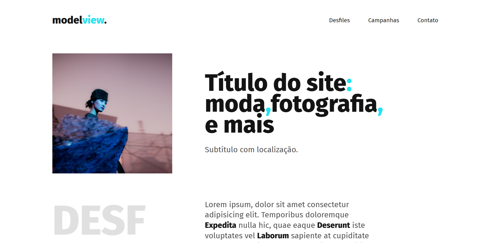

<h1 align="center">👠 Modelview 👠 </h1>



## About:

Landing page of a fashion newsletter where the user can see some information about the latest news and events.<br>

Front-end web application, made with vanilla JavaScript. <br>

**Demo**: https://modelview.netlify.app/

## Main tools:

- [HTML](https://developer.mozilla.org/en-US/docs/Web/HTML);
- [CSS](https://developer.mozilla.org/en-US/docs/Web/CSS);
- [JavaScript](https://developer.mozilla.org/en-US/docs/Web/JavaScript);

## Running locally:

> Before installing the project, make sure that you have [Node](https://nodejs.org/en) and [GIT](https://git-scm.com/) already installed in your machine.

1. Open your favorite terminal.

2. Run the following commands:

```shell
# clone repository:
git clone git@github.com:celiovjunior/js-site.git

# go to the project folder:
cd js-site

# open the index file:
start index.html

# OR open the folder and double click in the index file:
```
